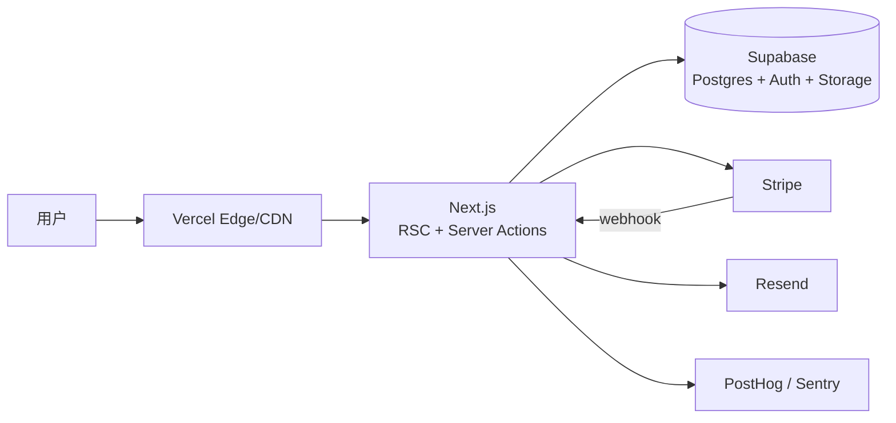
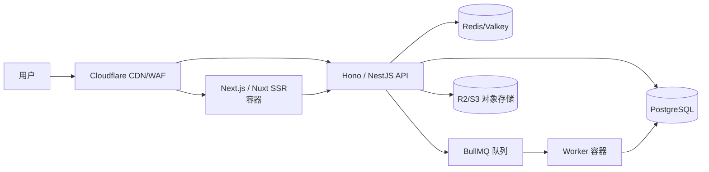
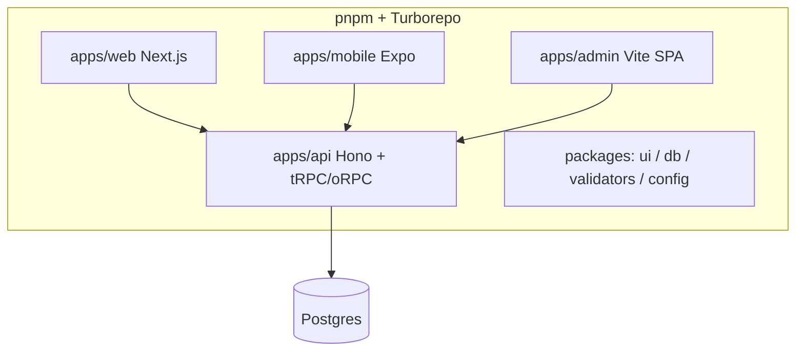
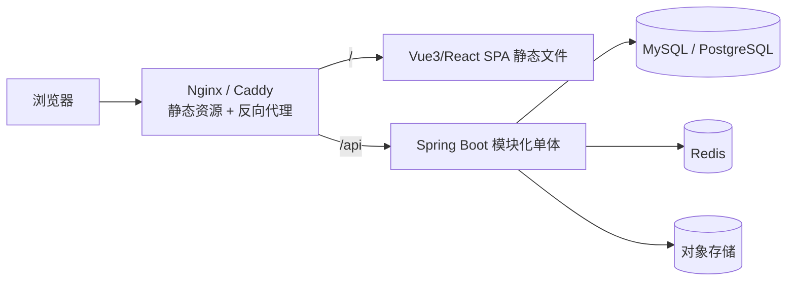
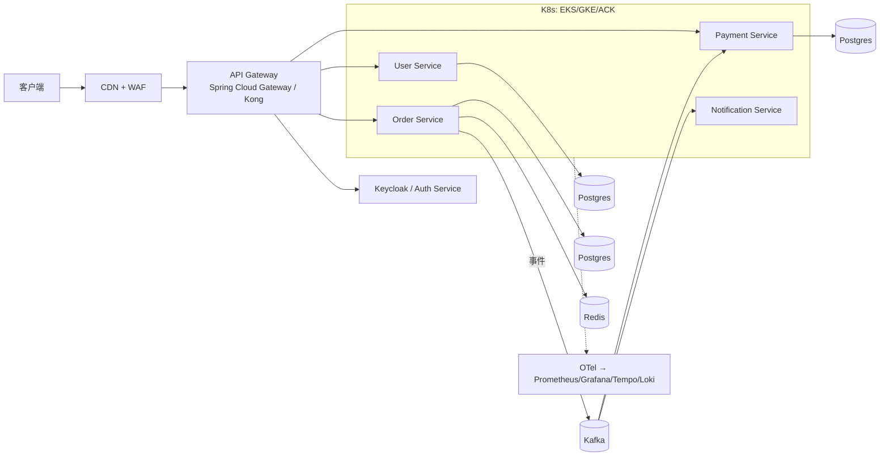
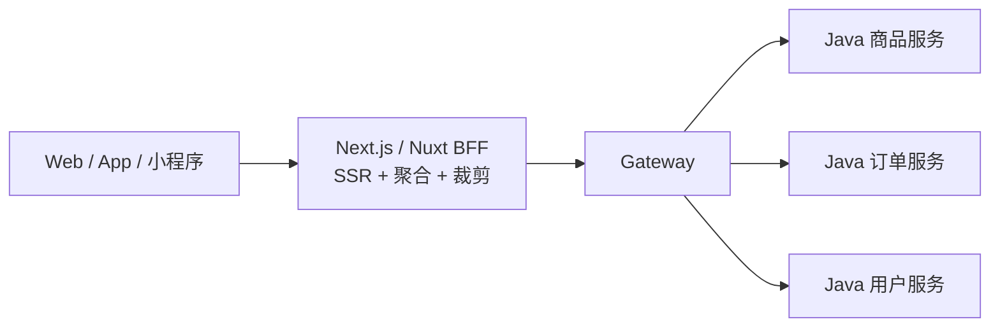
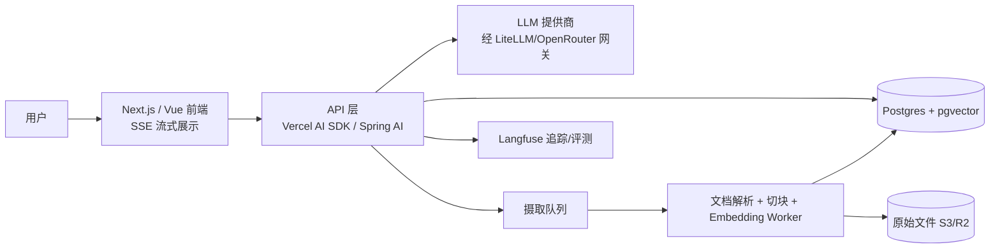
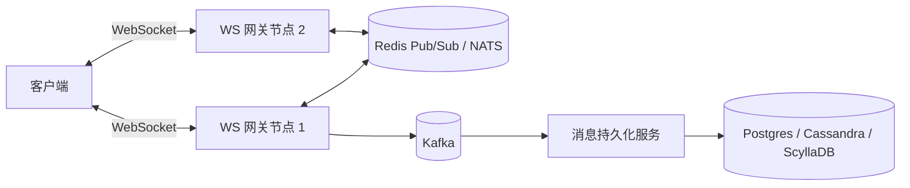

# 参考架构方案库（10 套）

> 适用范围：按场景选出最接近的方案，再按需求裁剪；不要原样照搬
> 来源：《现代软件系统架构设计与托管部署参考手册》，章节编号 §x 与原手册一致，便于交叉引用。
> 时效：信息核验于 2026-09。版本号只写主版本；价格、免费额度、许可证以官网当期为准，输出方案时标注「需核验」。

**目录**：方案 A 独立开发者/MVP SaaS · B TS 全栈生产级 · C TS Monorepo 多端 · D 经典前后端分离（Java） · E Java 企业级微服务 · F Node BFF + Java 领域服务 · G 内容站/营销站 · H 中国大陆业务 · I AI 应用（RAG/Agent） · J 实时协作/IM

---

## 9. 参考架构方案库（10 套）

每套方案包含：适用场景、架构图、技术栈、部署、优缺点、演进路径。AI 输出时应从中选取最接近的方案再按需求裁剪，而不是原样照搬。

### 方案 A：独立开发者 / MVP SaaS（B 线，最快上线）

**适用**：1–3 人、验证想法、出海订阅产品。

| 层 | 选择 |
|---|---|
| 前端 | Next.js + Tailwind CSS + shadcn/ui |
| 后端 | Next.js Route Handlers / Server Actions |
| 数据/认证/存储 | Supabase（或 Neon + Better Auth + R2） |
| ORM | Drizzle |
| 支付 | Stripe（或 Paddle/Polar 作 MoR） |
| 部署 | Vercel |
| 可观测 | Sentry + PostHog |

**优点**：几天可上线、近乎零运维。**缺点**：厂商绑定、长任务受限、规模化后成本上升。
**演进**：后台任务外置到 Trigger.dev/Inngest → 独立 API 服务 → 迁移到容器平台。

---

### 方案 B：TS 全栈生产级（B 线，可自托管）

**适用**：3–10 人、中等规模、希望控制成本和部署。

| 层 | 选择 |
|---|---|
| 前端 | Next.js / Nuxt，TanStack Query |
| API | Hono（轻）或 NestJS（重），Zod 校验，OpenAPI 输出 |
| 数据 | PostgreSQL + Drizzle/Prisma，Redis |
| 队列 | BullMQ worker |
| 认证 | Better Auth / Clerk |
| 部署 | Railway / Fly.io / Cloud Run，或 VPS + Coolify |
| 可观测 | OpenTelemetry → Grafana Cloud，Sentry |

**演进**：拆分 worker 独立扩缩 → 读副本 → 按域拆服务。

---

### 方案 C：TS Monorepo 多端（Web + App + 后台）

**适用**：同时有 Web、移动 App、管理后台，团队全 TS。

部署：web → Vercel；mobile → EAS Build + EAS Update（OTA）；admin → Cloudflare Pages；api → Fly.io / Cloud Run。
**要点**：共享 Zod schema 与类型；移动端 API 需版本兼容（旧 App 长期存在），公开接口用 OpenAPI 而非仅 tRPC。

---

### 方案 D：经典前后端分离（A 线，最常见）

**适用**：Java 后端团队、企业内部系统、中后台、校园/课程项目。

| 层 | 选择 |
|---|---|
| 前端 | Vite + Vue3 + Pinia + Element Plus，或 React + Ant Design；OpenAPI 生成客户端 |
| 后端 | Spring Boot 4 + Java 25 虚拟线程 + JPA/MyBatis-Plus + Flyway |
| 安全 | Spring Security（Session 或 JWT） |
| 缓存 | Caffeine + Redis |
| 部署 | Docker Compose on VPS；或前端 Cloudflare Pages + 后端 Railway/Render/Cloud Run |
| CI/CD | GitHub Actions → GHCR → SSH 部署 |

**同域部署**（Nginx 反代 `/api`）可避免 CORS 与第三方 Cookie 问题，优先采用。
**演进**：多实例 + 负载均衡 + 会话外置 → 消息队列解耦 → 按需拆服务（方案 E）。

---

### 方案 E：Java 企业级微服务（A 线，大规模）

**适用**：多团队、业务域清晰、流量大、需独立扩展。

| 能力 | 选择 |
|---|---|
| 服务框架 | Spring Boot + Spring Cloud（国内可用 Spring Cloud Alibaba：Nacos + Sentinel + Seata） |
| 通信 | 同步 REST/gRPC，异步 Kafka；Outbox 保证消息可靠 |
| 事务 | Saga（Temporal / 事件编排） |
| 数据 | 每服务独立库 |
| 部署 | K8s + Helm + Argo CD，HPA/KEDA |
| 可观测 | OpenTelemetry 全链路 |

**前提**：已有平台工程能力与完善的 CI/CD、可观测性。否则先做方案 D 的模块化单体。

---

### 方案 F：混合架构（Node BFF + Java 领域服务）

**适用**：后端是 Java，但前端需要 SSR/SEO 或多端数据聚合；大型电商、门户。

**分工**：BFF 负责渲染、聚合、端差异、会话；Java 负责领域逻辑、事务、数据。BFF 通过 OpenAPI 生成的客户端调用 Java 服务。
**部署**：BFF 在 Vercel / 容器；Java 在 K8s / Cloud Run；同地域以降低延迟。

---

### 方案 G：内容站 / 营销站 / 文档站

**适用**：官网、博客、文档、落地页。

- Astro（或 Next.js SSG / VitePress / Nuxt Content）+ Headless CMS（Sanity / Payload / Strapi）
- 部署：Cloudflare Pages / Netlify / Vercel，CMS 发布触发 Webhook 重建或 ISR
- 分析：Plausible / Umami（GDPR 友好、无 Cookie）
- 表单：Formspree / 自建 Serverless 函数 + Turnstile

---

### 方案 H：中国大陆业务（含小程序）

**适用**：面向国内用户。

| 层 | 选择 |
|---|---|
| 前端 | Vue3 / React；小程序 + H5 + App 一套：**uni-app** 或 **Taro** |
| 后端 | Spring Boot + Spring Cloud Alibaba（Nacos、Sentinel），或 NestJS |
| 数据 | MySQL / PolarDB、Redis、OSS/COS |
| 认证 | 微信登录 / 手机号验证码 + 自建（Sa-Token / Spring Security） |
| 支付 | 微信支付、支付宝 |
| 部署 | 阿里云 / 腾讯云：ECS / ACK / SAE / 云托管；CDN + WAF |
| 合规 | **ICP 备案**、公安备案、等保（按需）、PIPL；小程序需类目资质与隐私协议 |
| 可观测 | SkyWalking、阿里云 ARMS / SLS |

注意：Vercel、Cloudflare Workers、Clerk、Stripe、Resend、Google 系服务在大陆不可用或不稳定，需全部替换。

---

### 方案 I：AI 应用（RAG / Agent）

| 层 | TS 路线 | Java 路线 |
|---|---|---|
| 编排 | Vercel AI SDK / Mastra / LangChain.js | Spring AI / LangChain4j |
| 向量 | pgvector → Qdrant（规模化） | 同左 |
| 工具调用 | MCP servers | Spring AI MCP |
| 观测评测 | Langfuse、promptfoo | Langfuse |

要点：SSE 流式、长任务异步化、Token 成本计量与按用户限额、提示注入与越权工具调用防护、RAG 权限过滤（检索时按用户权限过滤文档）、缓存语义结果。

---

### 方案 J：实时协作 / IM / 通知

- 小规模：托管服务（Ably、Pusher、Supabase Realtime、Liveblocks、PartyKit）
- 自建：Socket.IO + Redis Adapter / Spring WebSocket (STOMP) + 消息代理；负载均衡需粘性会话或统一广播层
- 协作编辑：CRDT（Yjs、Automerge）+ Hocuspocus / y-websocket
- 离线消息与推送：FCM / APNs / 厂商通道

